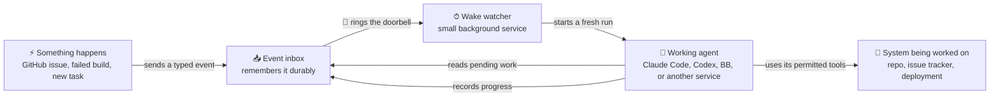
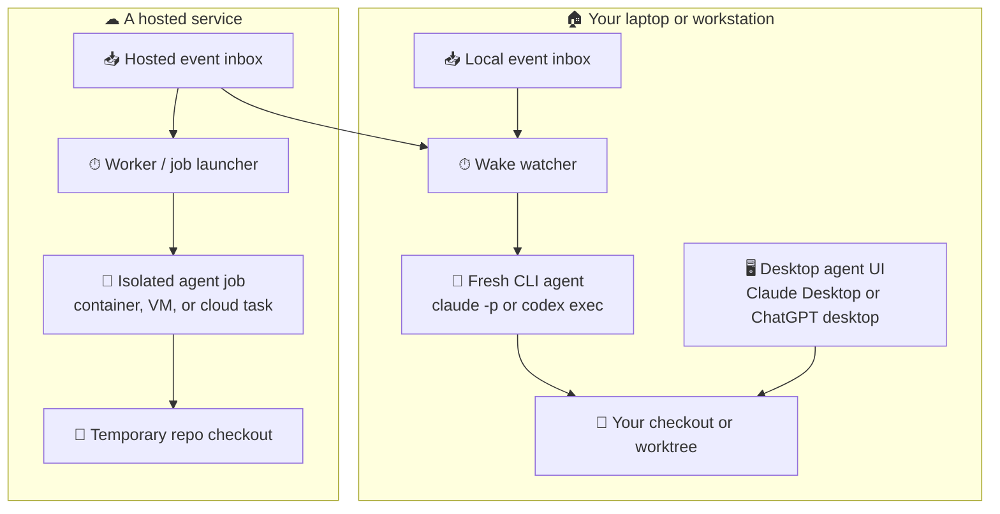
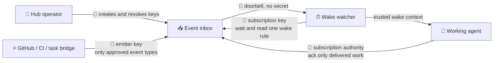
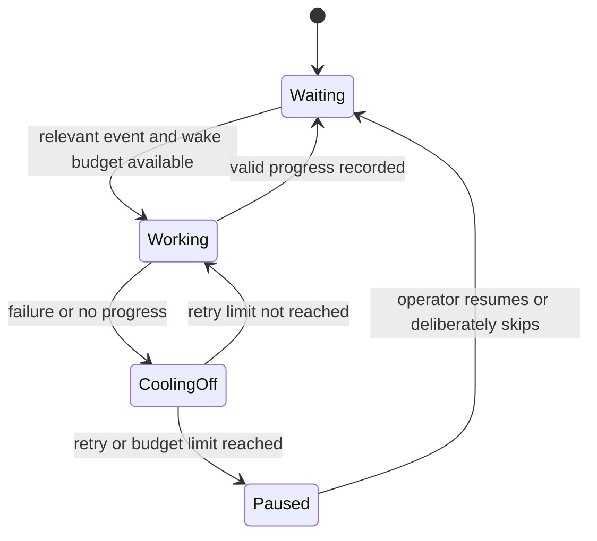

# How agent-wake fits into the agents people use today

agent-wake connects an event that happened somewhere else to a fresh agent run.
The agent does not need to sit open, poll continuously, or expose a webhook URL.

The shortest explanation is:

> An event inbox remembers what happened. A wake watcher notices relevant work
> and starts an agent. The agent reads its pending work, handles it, records its
> progress, and exits.

## Friendly names for the protocol pieces

The protocol names are useful when implementing the API. The friendly names are
usually better when explaining the system to someone using Claude Code, Codex,
or another agent product.

| Friendly name | Protocol name | What it means | Concrete example |
| --- | --- | --- | --- |
| **Event source** | emitter | The system where something happened | GitHub, Linear, CI, Slack, a filesystem watcher |
| **Event inbox** | hub | The durable place that remembers events | The `agent-wake hub` process, locally or on a server |
| **Wake rule and bookmark** | subscription + cursor | Which events this agent cares about and how far it got | “Only `deploy.failed`; handled through event 41” |
| **Doorbell** | thin ping | A payload-free hint that work is waiting | “Subscription 7 has three pending events” |
| **Wake watcher** | spawner | The small always-on program that knows how to start the agent | `agent-wake watch --codex`, a system service, or a serverless trigger |
| **Working agent** | agent / consumer | The reasoning run that reads events and uses tools | One `claude -p` run, one `codex exec` run, a BB thread, or a hosted job |

The **model** is not the agent by itself. Claude or a GPT model supplies the
reasoning. The **working agent** is the whole running session: model, prompt,
tools, permissions, checkout, credentials, and execution environment.

Likewise, a **wake watcher** is not another intelligent agent. It is deliberately
boring plumbing. Its job is to wait cheaply, start one working agent, and enforce
basic pacing before another expensive run starts.

## The everyday flow

The diagrams use a small, repeated visual vocabulary: ⚡ event source, 📥 event
inbox or space, 🔔 doorbell, ⏱ wake watcher, 🤖 working agent, 🛡 policy, 🧰 tools,
and 🔑 authority. Every icon is paired with text so the meaning survives plain
text, screen readers, and Mermaid renderers with limited fonts.



The doorbell contains no issue text, email body, secrets, or instructions. It
only says that the working agent should check its event inbox. The inbox remains
the source of truth if a doorbell is delayed, duplicated, or lost.

## Where each part can run

The pieces do not all have to be local or all have to be hosted.



The desktop boxes are shown to explain where people interact with agents today.
The current reference implementation launches command-line agents and BB
threads; it does not yet create a new Claude Desktop, ChatGPT desktop, or Codex
cloud conversation directly.

## Concrete setups

### Claude Code running on your computer

Today the repository supports:

```sh
agent-wake watch --claude
```

The wake watcher runs on the computer that has the repository. When work is
waiting, it starts a non-interactive `claude -p` process. That fresh Claude Code
run works in the directory and under the operating-system account and Claude
Code permissions given to the watcher.

Claude Code also has a desktop interface, but that interface is not the thing
this command launches. A future desktop adapter could ask the desktop product
to create a session if it exposes a suitable supported entry point. Until then,
“Claude Code support” in this repository specifically means the local CLI.

### Codex running on your computer

Today the repository supports:

```sh
agent-wake watch --codex
```

The watcher starts `codex exec` as a fresh local process. The process can work
in the current checkout with Codex's sandbox and approval policy.

Codex in the ChatGPT desktop app can also work in a local checkout or an
isolated Git worktree. That UI is a client around agent sessions; it is not the
same thing as a continuously running agent server. Codex also provides an
app-server interface for rich local clients. An app-server adapter is a possible
future wake target, but the current implementation does not depend on it.

### A BB thread

The included BB plugin acts as the wake watcher. It long-polls the event inbox
and starts a new BB thread in the configured project. BB supplies the working
environment, permissions, agent provider, and user-visible thread. This is an
example of a product-native adapter: the watcher asks the product to create a
thread instead of shelling out to a CLI.

### A hosted or web agent

A hosted agent is the same logical flow with a different wake watcher:

1. A small worker waits for the doorbell.
2. It calls the agent service's “create task” or “start run” API.
3. The service creates an isolated container or VM and checks out the repo.
4. The working agent reads only the events allowed by its wake rule.
5. The job records progress and exits.

For example, a future Codex cloud adapter could create a cloud task rather than
run `codex exec`. A generic Kubernetes adapter could create a Job. A CI adapter
could dispatch a workflow. These are possible adapters, not current claims of
support.

### The event inbox on the web, the agent at home

This is often the most useful arrangement. Put the event inbox on a reachable
server, but keep the wake watcher and agent on a developer workstation. The
watcher makes an outbound long-polling connection, so the laptop needs no public
URL and accepts no inbound webhook traffic.

The reference hub is not ready for this deployment yet: it is currently
unauthenticated localhost plumbing. Do not expose it until the capability and
read-isolation milestones in [SECURITY.md](SECURITY.md) have shipped.

## What restrictions can an agent service add?

agent-wake decides which events may wake which subscription and how often.
The agent runner or hosted service decides what the resulting agent may do.
Both layers are necessary.

| Control | Enforced by | Example |
| --- | --- | --- |
| Event source and event types | Event inbox | A GitHub bridge may emit `github.*`, but may not claim to be CI |
| Read isolation | Event inbox | A deploy watcher cannot read HR or email events |
| Wake rate and budget | Event inbox | At most one wake per minute; park after five runs without progress |
| Filesystem boundary | Agent runner | Write only the selected checkout or disposable worktree |
| Network boundary | Agent runner | No network, or allow only GitHub and the event inbox |
| Tool boundary | Agent runner | Permit tests and repository edits; deny cloud administration |
| Credential scope | Agent service / source system | Read one repo, comment on one project, deploy only staging |
| Human approval | Agent runner / product | Ask before publishing, merging, deleting, deploying, or spending money |
| Runtime and cost | Agent service | Maximum duration, tokens, concurrent runs, and daily spend |
| Isolation and cleanup | Agent service | One ephemeral container or worktree per run |
| Audit | Both | Record wakes, cursor changes, approvals, tool calls, and external writes |

Examples available in current agent products include:

- Codex CLI and the ChatGPT desktop Codex experience can use a workspace
  filesystem sandbox, approval gates, and network restrictions. Codex cloud
  uses isolated managed containers; agent-phase network access is off by
  default, and configured secrets can be restricted to setup rather than the
  reasoning phase.
- Claude Code supports allow, ask, and deny rules for tools, plus OS-enforced
  filesystem and network sandboxing. A headless wake should use a deny-by-default
  mode or an explicit tool surface instead of bypassing permissions.
- Other providers can enforce the same ideas with container policies, scoped
  service accounts, egress proxies, short-lived credentials, approval queues,
  and per-run budgets even if their product vocabulary differs.

Provider restrictions do not replace hub restrictions. A perfectly sandboxed
agent can still waste money in a wake loop, and a perfectly authenticated event
inbox can still deliver attacker-authored issue text to a reasoning model.

## Capabilities, in plain language

A capability is a high-entropy bearer token that acts like a valet key. It
identifies both a resource and the narrow actions its holder may perform.

The small design needs two operational capabilities and one bootstrap:



- An **emitter key** may append approved event types. The inbox—not the request
  body—records the trusted source name.
- A **subscription key** may wait, read filtered events, and advance one
  bookmark.
- An **operator key** creates, rotates, and revokes those keys. It does not need
  to enter the working agent's prompt or environment.

The clearer design rule is:

> Every security-sensitive operation requires narrow authority, and every
> expensive wake decision is enforced before the working agent starts.

This is broader and more accurate than “make every write path a capability”:
sensitive reads need authority too, while valid authorization still does not
make an invalid cursor, malicious event body, or unsafe external action correct.

## Delivery and side effects

agent-wake provides **at-least-once processing**, not magical exactly-once
effects. If an agent comments on an issue and crashes before recording progress,
the event is delivered again. Consumers should use the stable event ID as an
idempotency key or check the destination before repeating an external action.

The intended lifecycle is:



## Security boundaries to remember

1. **The event body is untrusted data.** An authenticated GitHub bridge can
   faithfully relay attacker-authored issue text. Provenance is not content
   safety.
2. **The configured inbox is trusted; the doorbell is not.** The watcher should
   validate or replace URLs and subscription identifiers before starting the
   agent.
3. **Authorization is not validation.** The inbox must reject malformed,
   regressing, or future cursor acknowledgements even from the correct holder.
4. **Filters must be enforced on reads.** Filtering only the wake still lets an
   agent see and process unrelated events.
5. **References minimize data; they do not guarantee confidentiality.** A repo
   name, issue URL, customer ID, or signed URL may itself be sensitive.
6. **The reasoning run receives hostile text.** Use deterministic schema and
   source checks before optional model triage, and give the working agent the
   smallest useful filesystem, network, tool, and credential surface.
7. **No progress must eventually stop waking.** Backoff, budgets, parking, and
   an audited deliberate skip keep a poison event from becoming an infinite bill.

The implementation status, open risks, and shipping order are maintained in
[SECURITY.md](SECURITY.md).

For the proposed evolution from one local inbox to globally reachable,
separately governed spaces—and the possible role of policy providers such as
White Circle—see [GLOBAL_EVENT_BUS.md](GLOBAL_EVENT_BUS.md).

## Product documentation referenced

- [Codex cloud environments](https://learn.chatgpt.com/docs/environments/cloud-environment.md)
- [Codex local environments](https://learn.chatgpt.com/docs/environments/local-environment.md)
- [Codex worktrees](https://learn.chatgpt.com/docs/environments/git-worktrees.md)
- [Codex agent approvals and security](https://learn.chatgpt.com/docs/agent-approvals-security.md)
- [Codex app-server](https://learn.chatgpt.com/docs/app-server.md)
- [Claude Code setup and desktop option](https://code.claude.com/docs/en/getting-started)
- [Claude Code permissions](https://code.claude.com/docs/en/permissions)
- [Claude Code sandboxing](https://code.claude.com/docs/en/sandboxing)

These links describe product surfaces and restrictions, not integrations that
agent-wake automatically provides.
