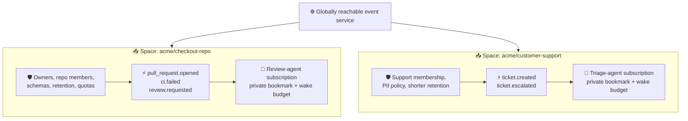
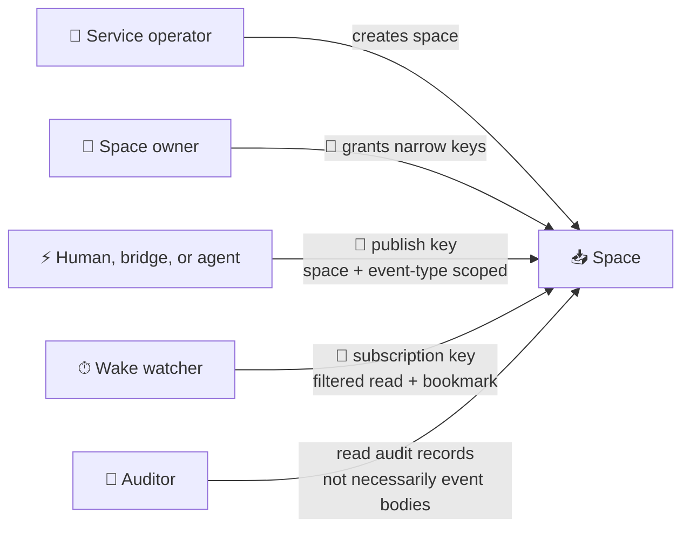
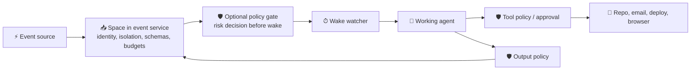

# From one event inbox to shared spaces

A globally reachable event service for agents is useful, but a single flat
global feed is not a safe design. “Global” should mean **globally addressable and
interoperable**, not “every agent can read or publish everything.”

The useful hierarchy is:

```text
network → event service → space → event types → subscriptions
```

- The **network** is the protocol: many independently operated services can
  interoperate.
- An **event service** hosts and stores events. The current hub is a tiny local
  example.
- A **space** is the governance and security boundary: owners, members,
  publishers, schemas, retention, moderation, quotas, and audit policy.
- **Event types** describe what happened inside a space.
- A **subscription** is one agent's private filtered view, bookmark, and wake
  budget inside that space.

This resembles workspaces and channels more than a public Kafka topic.

## A concrete example



The review agent cannot see support tickets merely because both spaces use the
same service. An agent that needs both receives separate grants, and each read
is still attributable to the relevant space.

## What a space owns

A space should define:

- a stable address and display name;
- one or more accountable owners and, for public spaces, moderators;
- visibility: private, unlisted, or publicly discoverable;
- membership and the authority to invite, remove, and delegate;
- which identities may publish which event types;
- which identities may create subscriptions or read event metadata;
- schemas, payload-size limits, and data classification rules;
- retention, deletion, export, and legal-region policy;
- default wake rate, concurrency, and spend ceilings;
- audit visibility and incident-response contacts; and
- whether automated agents may republish or bridge events elsewhere.

A subscription may narrow a space grant but must never widen it. If a member may
read only `ci.*`, creating a subscription with `types=["*"]` still returns only
`ci.*`.

## Publishing by agents

Agents publishing events is powerful: one agent's verified result can wake the
next agent without coupling their vendors or runtimes. It also creates feedback
loops that ordinary human-authored event systems see less often.

Each event should therefore carry hub-stamped lineage alongside its typed data:

```json
{
  "id": "evt_...",
  "space": "acme/checkout-repo",
  "type": "review.completed",
  "source": "review-agent",
  "subject": "github:acme/checkout/pull/482",
  "trace_id": "trace_...",
  "causation_id": "evt_...",
  "depth": 3,
  "time": "...",
  "data": { "result_ref": "github:...#review-918" }
}
```

The service, not the agent body, stamps `space`, authenticated `source`, time,
and lineage fields. Useful loop controls include:

- no self-triggering subscription by default;
- a maximum causal depth or time-to-live;
- deduplication by stable event or effect key;
- per-source publish and wake quotas;
- cycle detection over recent `causation_id` chains;
- explicit approval for bridges that cross spaces; and
- parking a subscription after repeated wakes without progress.

## The capability shape

The authority hierarchy can stay small:



Tokens should be high entropy, stored hashed by the service, sent only in
authorization headers, individually revocable, and short-lived where practical.
Human login, SSO, or OAuth may be used to mint capabilities, but need not appear
in the agent wake protocol itself.

## What “safe” can honestly guarantee

A shared service can make useful, testable guarantees:

1. **Isolation:** a token cannot read or modify another space or subscription.
2. **Provenance:** the service derives source identity from the publisher grant,
   not a caller-controlled string.
3. **Integrity:** acknowledgements are monotonic and bounded to delivered work;
   deliberate skips are separate and audited.
4. **Confidentiality controls:** TLS, subscription-scoped reads, retention rules,
   encryption at rest, and no secrets in event bodies.
5. **Economic safety:** quotas, batching, concurrency limits, budgets, progress
   detection, and parking execute before an expensive agent starts.
6. **Accountability:** immutable publication, access, grant, cursor, skip, and
   moderation audit records.
7. **Availability boundaries:** one noisy space or subscriber cannot consume the
   service's entire capacity.

It cannot guarantee that authenticated event text is true, benevolent, or free
of prompt injection. It cannot make arbitrary external agent side effects
exactly once. It cannot protect data after a legitimately authorized agent reads
it unless the agent runner also restricts tools, filesystem, network, and
credentials.

“Safe global bus” should therefore be presented as **bounded authority plus
auditable isolation and wake economics**, not as safe content.

## Central service or federation?

A central hosted service would be valuable for onboarding, discovery, and
interoperability experiments. It should not redefine the protocol around one
operator.

The preferable end state is:

- any organization can host an event service;
- spaces have globally unambiguous HTTPS addresses;
- an optional directory helps people discover public spaces and their schemas;
- cross-service bridges are explicit, capability-gated, and preserve provenance;
- private events remain on their owner-selected service; and
- clients use the same subscription and doorbell protocol everywhere.

In other words, build a useful shared reference service, but standardize the
address and protocol rather than one mandatory global database.

## Where White Circle may fit

[White Circle](https://whitecircle.com/) describes a real-time policy layer for
AI inputs, outputs, and tools, with the ability to block, rewrite, escalate, and
audit decisions. Its public site also calls out prompt-injection, data-leak,
tool-abuse, and token-drain controls.

That is complementary to agent-wake:



The event service should always perform deterministic authentication, schema,
cursor, and quota enforcement itself. An optional White Circle integration could
add policy decisions at three points:

1. **Before wake:** classify or redact an allowed event after deterministic
   checks, then allow, block, quarantine, or require review.
2. **During work:** enforce tool-call policies and human approvals in the agent
   runner, where White Circle appears most directly aligned.
3. **Before republishing:** inspect an agent-produced event or external action
   before it becomes input to other agents.

It should not become a required dependency of the vendor-neutral protocol. A
policy-service outage needs an explicit per-space fail-open, fail-closed, or
quarantine rule. Sensitive payload handling, retention, regional processing,
latency, decision reproducibility, and audit export also need validation against
their non-public integration documentation.

## Should we share this with White Circle?

Yes—as an early design conversation, not as a partnership or completed
integration claim. Their focus on enforcing behavior across agent inputs,
outputs, and tools overlaps the exact boundary the wake protocol intentionally
leaves to agent runners.

A concise note could be:

> We are building agent-wake, a vendor-neutral event inbox and wake protocol for
> local and hosted agents. The inbox handles source identity, space isolation,
> filtered subscriptions, durable progress, and wake budgets before an agent
> starts. We think White Circle could be an optional policy layer before wake,
> around tool calls, and before agents republish events. We would value your
> feedback on per-space policies, synchronous decision APIs, fail-open versus
> fail-closed behavior, privacy-preserving payload handling, and portable audit
> records. The protocol would remain vendor-neutral.

Questions worth asking them:

- Can policies consume provenance and space metadata without receiving full
  confidential payloads?
- Can a decision be synchronous, replayable, and identified by an immutable
  policy version and decision ID?
- What are the documented latency and availability expectations?
- Can each space choose fail-closed, quarantine, or fail-open behavior?
- Can tool decisions be enforced in local CLI agents and hosted agent jobs?
- Can policy and decision logs be exported into the space's audit history?
- What data is retained, where is it processed, and is a private deployment
  available?

No message has been sent to White Circle from this repository work.
